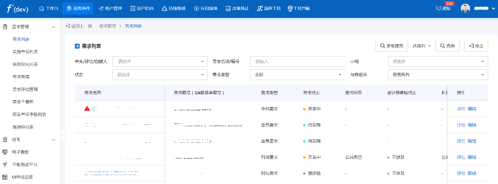

  
  <h1>fdev</h1>
   

## 💡 介绍

2022年浦发银行开发服务中心开始研发协作平台（fdev）开源项目，旨在面向金融行业各类业务主题和数据应用场景，为新业态下的金融业务发展和金融数据生态提供丰富的数据服务与解决方案。

fdev主要解决的问题在于提高开发人员的开发效率，使之将更多的精力投入到代码的开发及代码质量的提升，将眼光着重放在软件开发的核心阶段“任务”之上，围绕“任务”进行一系列阶段性步骤，包括任务创建、开发、SIT测试、UAT测试、REL测试、投产、归档等。同时使开发人员无需关注项目的持续集成，开发人员只需要保证代码提交到对应的测试分支，应用会根据流水线进行部署，并且用户可以自定义配置流水线插件，降低了用户配置流水线的门槛。

## 💯 特征
### 1.研发协作

研发协作旨在规范开发流程，提高开发效率，主要包含“需求管理”，“任务”，“电子看板”和“玉衡测试”等模块。

需求管理的整体架构图为：

需求与任务的模型层次为：

    需求 -> ipmp实施单元 -> 研发单元 -> 任务

玉衡测试平台是fdev的测试管理平台，能够高效管理任务测试工单的分配，以及任务后续测试流程的控制。

任务的开发、测试进度可通过电子看板来宏观把控。

### 2.投产管理

投产管理主要功能是自动生成某个投产窗口的所有应用生产环境所需准备的介质及材料。

投产管理

### 3.用户信息

fdev的用户信息系统方便地对所有的人员进行管理，涵盖了个人基础信息、角色信息、组织信息。

### 4.持续集成

持续集成模块通过fdev团队自主研发的持续集成调度工具fdev-ci-runner来支持并行与串行执行流水线任务，并且支持各类自定义持续集成任务调度。

fdev-ci-runner基于 Golang 开发，负责获取并执行流水线单步任务，用户可以自定义流水线步骤顺序提供给执行器工具运行来控制流水线，每个步骤支持配置运行基础镜像、运行集群、执行插件脚本、插件输入参数。

### 5.应用环境

应用环境包含应用、环境、接口、路由、组件、骨架、镜像、数据库等模块。应用模块用于管理fdev上录入的应用的信息。环境模块主要针对应用部署的环境进行管理。镜像模块主要是管理应用部署时的镜像信息。组件和骨架模块用于维护组件和骨架的信息，录入组件和骨架需求，发布组件和骨架的测试包和生产包。接口模块是对不同类型的接口/交易进行管理，以及对前端路由的版本备份。数据库管理模块主要为互联网条线开发人员提供服务，开发人员数据库管理菜单查询与应用关联的库表信息，以及数据库字段。

### 6.度量统计

度量统计工具对需求、任务、研发单元、投产、代码等多阶数据进行了可视化度量，通过仪表盘和报表能够清晰地对各数据进行分析。

### 7.流程工具

fdev的流程工具对工作中的多种繁琐流程进行了整合，提供了流程的申请与审核平台，涵盖了代码审核、网络审核等流程工具。

## 📚 项目架构与文档

| app                            | 名称                         | 介绍   |
|:-------------------------------|:-----------------------------|:--------|
|ebank-helper                    |[手机银行流水线CICD脚本模块](./ebank-helper/README.md) |以手机银行为主的流水线脚本      |
|fdev-app                        |[开发协作服务应用模块](./fdev-app/README.md)            |管理fdev平台上录入的项目信息         |
|fdev-blueking                   |[开发协作服务蓝鲸模块](./fdev-blueking/README.md)           |记录fdev录入应用的生产部署信息         |
|fdev-ci-pipeline                |[开发协作服务持续集成模块](./fdev-ci-pipeline/README.md)         |fdev平台持续集成后台项目         |
|fdev-ci-runner-main             |[开发协作服务流水线runner](./fdev-ci-runner-main/README.md)        |fdev项目流水线任务执行器         |
|fdev-common                     |[公共common包](./fdev-common/README.md)                   |fdev的公共组件包          |
|fdev-component                  |[开发协作服务组件模块](./fdev-component/README.md)            |组件发布管理         |
|fdev-config                     |[开发协作服务配置中心](./fdev-config/README.md)            |fdev平台各模块的配置文件         |
|fdev-configserver               |[开发协作服务配置中心服务端](./fdev-configserver/README.md)       |fdev项目配置中心服务端         |
|fdev-database                   |[开发协作服务数据库模块](./fdev-database/README.md)          |fdev所有录入项目的数据库管理         |
|fdev-demand                     |[开发协作服务需求模块](./fdev-demand/README.md)            |fdev所有录入项目的需求管理         |
|fdev-docmanage                  |[开发协作服务文档管理模块](./fdev-docmanage/README.md)        |fdev文档上传下载管理         |
|fdev-entity                     |[开发协作服务环境管理模块](./fdev-entity/README.md)        |fdev应用部署的环境管理         |
|fdev-env-config                 |[开发协作服务环境配置模块](./fdev-env-config/README.md)        |fdev应用部署所需要的变量管理         |
|fdev-footprint                  |[开发协作服务足迹采集模块](./fdev-footprint/README.md)        |fdev的用户行为足迹采集         |
|fdev-gitlabwork                 |[开发协作服务gitlab统计模块](./fdev-gitlabwork/README.md)      |gitlab代码统计         |
|fdev-helper                     |[开发协作服务流水线CICD脚本模块](./fdev-helper/README.md)   |fdev平台各模块的流水线脚本         |
|fdev-interface                  |[开发协作服务接口模块](./fdev-interface/README.md)            |fdev录入项目的接口管理         |
|fdev-job-executor               |[开发协作服务任务执行器模块](./fdev-job-executor/README.md)       |fdev定时任务执行器         |
|fdev-job-scheduler              |[开发协作服务任务调度器模块](./fdev-job-scheduler/README.md)       |fdev定时任务调度器         |
|fdev-notify                     |[开发协作服务通知模块](./fdev-notify/README.md)            |fdev发送用户消息、邮件         |
|fdev-process-tool               |[开发协作服务流程工具模块](./fdev-process-tool/README.md)        |fdev项目的代码审核管理         |
|fdev-release                    |[开发协作服务投产模块](./fdev-release/README.md)            |项目投产流程管理         |
|fdev-release-pythonscripts      |[开发协作服务投产python脚本](./fdev-release-pythonscripts/README.md)      |fdev投产模块辅助脚本         |
|fdev-report                     |[开发协作服务度量模块](./fdev-report/README.md)            |fdev统计指标模块         |
|fdev-sonar                      |[开发协作服务代码扫描模块](./fdev-sonar/README.md)         |fdev项目代码扫描         |
|fdev-task                       |[开发协作服务任务模块](./fdev-task/README.md)            |fdev项目需求的开发任务管理         |
|fdev-user                       |[开发协作服务用户模块](./fdev-user/README.md)            |fdev平台用户管理         |
|fdev-vue-admin                  |[开发协作服务前端](./fdev-vue-admin/README.md)                |fdev平台前端项目         |
|fdev-webhook                    |[开发协作服务webhook模块](./fdev-webhook/README.md)         |项目gitlab的webhook回调         |
|testmanage-admin                |[玉衡测试服务平台权限模块](./testmanage-admin/README.md)         |玉衡测试平台的用户权限管理         |
|testmanage-auto                 |[玉衡测试服务平台自动化测试模块](./testmanage-auto/README.md)   |玉衡测试平台自动化测试服务         |
|testmanage-mantis               |[玉衡测试服务平台对接缺陷模块](./testmanage-mantis/README.md)     |玉衡测试平台对接mantis系统         |
|testmanage-plan                 |[玉衡测试服务平台计划模块](./testmanage-plan/README.md)         |玉衡测试平台测试计划管理         |
|testmanage-testcase             |[玉衡测试服务平台案例模块](./testmanage-testcase/README.md)         |玉衡测试平台测试案例管理         |
|testmanage-ui                   |[玉衡前端](./testmanage-ui/README.md)                        |玉衡平台前端项目         |
|testmanage-workorder            |[玉衡测试服务平台工单模块](./testmanage-workorder/README.md)         |玉衡测试平台测试工单管理         |
|testmanage-user                 |[玉衡测试服务平台用户模块](./testmanage-user/README.md)         |玉衡测试平台的用户管理         |

## 📅 更新日志

[CHANGELOG](./CHANGELOG.md)

## 🤝 需求/问题受理机制 & 代码贡献

如果您有好的意见或建议，欢迎创建[Issues](https://github.com/spdb-opensource/fdev/issues)或[Pull Requests](https://github.com/spdb-opensource/fdev/pulls)，为 fdev 开源社区做贡献。

### 需求/问题受理机制 -> Issues

在提交Issue之前，请确保满足以下条件：

- 可以是BUG、新功能、文档捉虫或是交流
- 已在issue中搜索，未找到类似问题或解决方案
- 创建新问题时，请提供详细描述、截图或短视频，帮助我们定位问题

### 代码贡献 -> Pull Request

欢迎大家贡献代码，让fdev更加完善。代码团队会监控所有的拉取请求，我们会做相应的代码检查和测试。测试通过后，我们会接受PR，但不会立即合并到master分支。

请在完成 PR 前确认：

1. 从 master 分支 fork 自己的分支。
2. 修改代码后请修改相应文档和注释。
3. 请在新创建的文件中添加许可和版权声明。
4. 确保一致的代码风格。
5. 进行充分的测试。
6. 将此拉取请求信息添加到 [CHANGELOG](./CHANGELOG.md)。
7. 然后，您可以将代码提交到开发分支。
8. 从开发分支发起 pull request 请求到主仓库的 dev 分支。
9. 我们收到 pull request 请求后会进行审查，审查含两部分，一是人工审查，二是利用安全扫描工具进行扫描。
10. 审查没问题后，我们会最终合并到 master 分支。

## 📄 许可协议

fdev 遵守 [Apache-2.0 licensed](./LICENSE) 协议。

## 🚀 fdev项目CI/CD流水线

1. 用户搭建自己的k8s集群环境，并把k8s的认证配置文件存放到fdev-helper项目下，
   修改src目录下deploy_fdev.py部署脚本逻辑在部署不同环境集群(SIT/UAT/REL/PRO)使用哪个k8s认证配置文件，
   并将fdev-helper项目打成镜像推送到用户自己使用的仓库，供微服务应用流水线部署时作为基础镜像使用。
2. 修改fdev需要部署的微服务应用下.gitlab-ci.yml文件中镜像使用的镜像仓库信息为用户使用的镜像仓库信息。
3. 用户下载开源的Gitlab Runner并部署服务进程，使用命令注册Runner， 配置微服务.gitlab-ci.yml文件中Only关键字设置触发规则，Tags关键字配置运行的Runner名称
4. fdev项目分为多个微服务项目，每个微服务需要单独部署启动，微服务的项目配置文件管理在fdev-config模块下，fdev-config-server是微服务配置中心服务端，修改其应用
   配置文件读取方式从fdev-config中加载，每个微服务可以在bootstrap.properties中配置fdev-config-server的外部配置请求地址。
   

## 🔗 联系我们

[wuxr@spdb.com.cn](mailto:wuxr@spdb.com.cn); [chucl@spdb.com.cn](mailto:chucl@spdb.com.cn); [pangxy1@spdb.com.cn](mailto:pangxy1@spdb.com.cn); [zhanghp4@spdb.com.cn](mailto:zhanghp4@spdb.com.cn); [liux71@spdb.com.cn](mailto:liux71@spdb.com.cn); [zhangyx20@spdb.com.cn](mailto:zhangyx20@spdb.com.cn)

